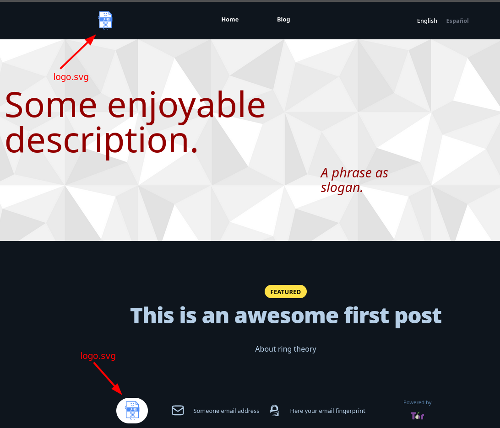

# How to start with your Torified blog

The first thing to do with your new Torified blog, is to add some custom stuffs but remember **DO NOT** put information
that allows to identify to you. This template has the simplest content to do your blog completely anonymous, take care
about what information you share in a public way.

#### Warning
For simplicity, we suggest **ONLY** make changes on the folders and files we specify in these instructions.

## 1. Change logo

To change the image logo you need to have an `.svg` file named `logo.svg` and stored in `/assets/images/`. Preferable this
image must be a square image. This change will modify the image that show here.

## 2. Change hero section in lading page

In order of change the hero section into the landing page, you have three elements that can customize.

1. **Description:** Go to the internationalization directory `_i18n` and find two files `en.yml` and `es.yml`. In each one 
    of these, edit the tag `site.description` with your own description.
2. **Slogan:** Go to the internationalization directory `_i18n` and find two files `en.yml` and `es.yml`. In each one
   of these, edit the tag `site.slogan` with your own slogan.

Remember do these two changes in both files to allow that the page to show the text in both languages.

3. **Background:** To change the background in the hero section, first you need have an image named `background-desktop.png`
    and replace with this the image with the same name into the directory `assets/images`.

## 3. Change footer content.

You can expose your email and the corresponding GPG fingerprint (if you have one).

#### Warning
Be sure that the email you expose is secure and anonymous. Use a service like [Riseup](https://riseup.net/) and similar.

1. **Email:** Go to `_data/` directory and find the file `locations.yml`. In this file change the `name` under `- location: Email address`
with your secure mail.

2. **GPG fingerprint:** Go to `_data/` directory and find the file `locations.yml`. In this file change the `name` under `- location: GPG fingerprint`
   with the fingerprint.

#### Note
If you do not have a fingerprint delete de section `- location: GPG fingerprint`.

# 4. Add posts to your blog

You can use the template (`post_template.md`) in `/DEV` directory to do new posts.

Remember to do spanish and english copies of your post, these two files mush have the same file name but each one must be
stored in their respective directory. For the spanish version use the directory is `/_i18n/es/_post` and for the english
version use the directory `/_i18n/en/_post`.

#### Remark
The name of your post fine **MUST** use this sintaxis `yyyy-mm-dd-title-of-your-post.md`. You can't replace `-` with any
other symbol, and in the title of your post, replace spaces with `-` i.e. _title of your post_ should be `title-of-your-post`.

Remember the name of the post file is not the same as the title of the post.

#### Example 
We located the next files for the post in English and Spanish located in the directories we specify.
##### Spanish

##### English

And we save the images as follows
##### Images folder

You will se this as follows

##### Featured

##### Blog Spanish visualization

##### Blog English visualization

##### Blog

