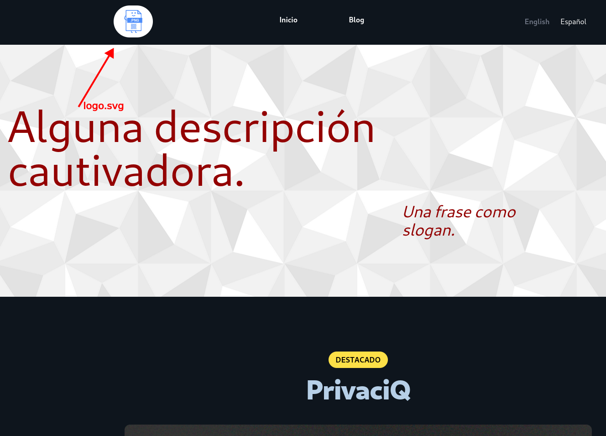
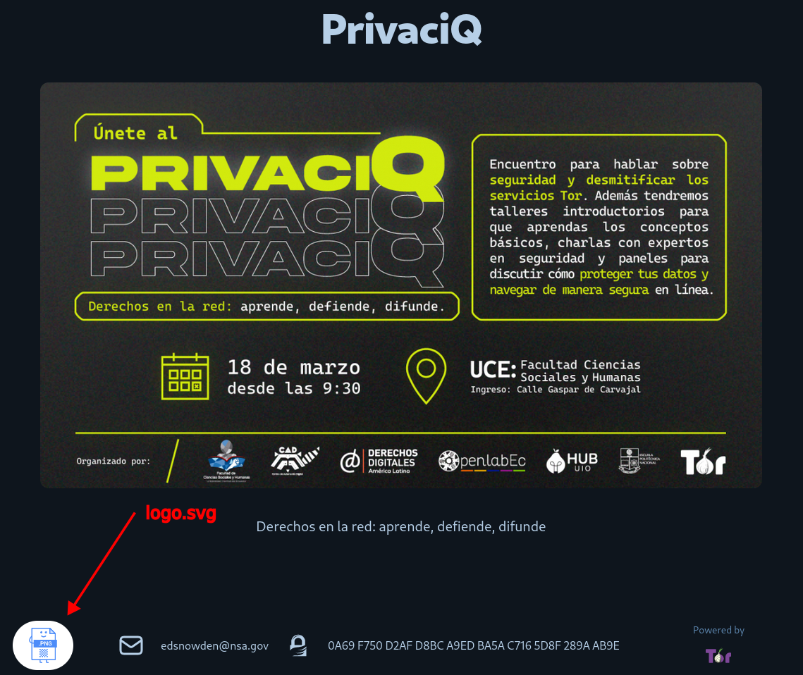
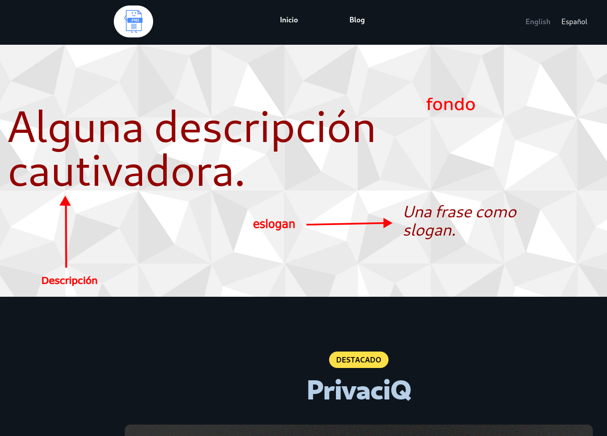
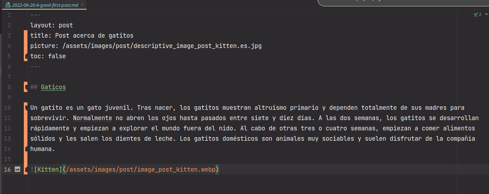
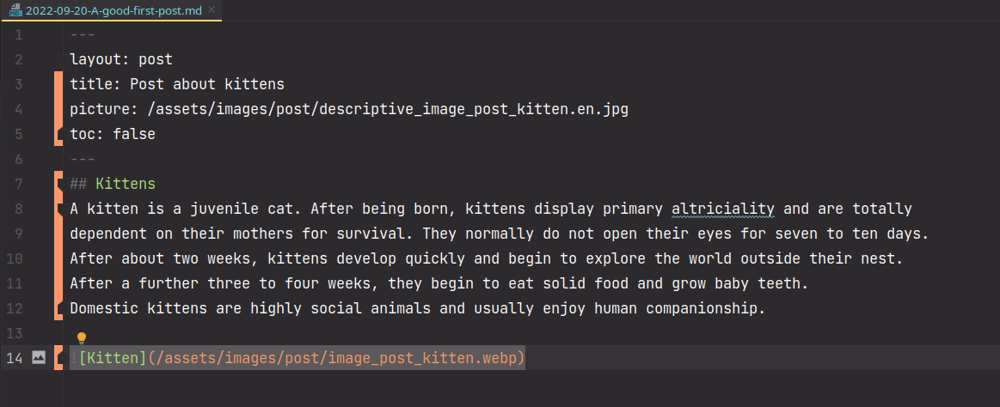
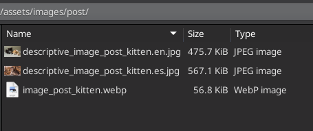
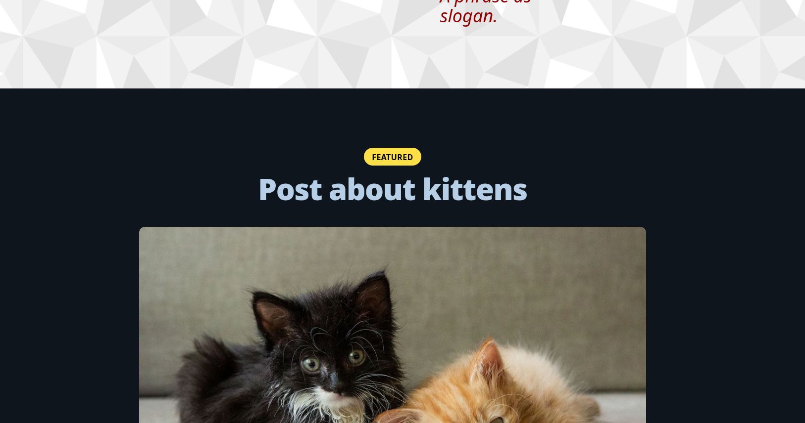
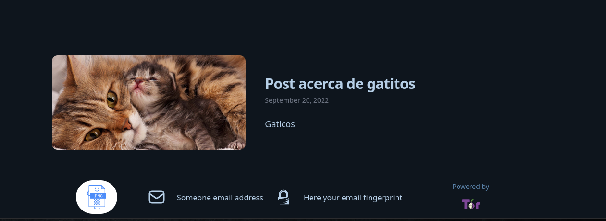
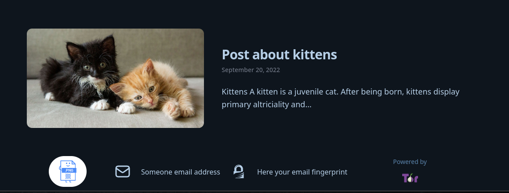
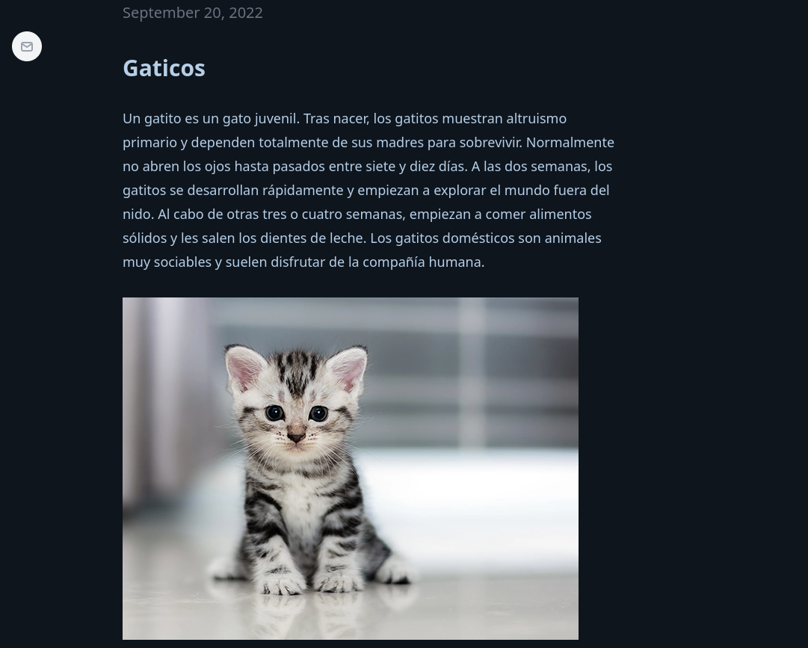

# Como empezar con el blog torificado

La primera cosa a hacer con su nuevo blog torificado es añadir algunas configuraciones, pero recuerde: **NO** ponga información que permitan identificarle. Esta plantilla tiene la configuración más simple para hacer a su blog completamente anónimo, así que tiene que tener cuidado con la información que comparte en este. 

## Advertencia

**Por simplicidad, sugerimos que sólo se hagan cambios en los directorios y archivos que especificamos en estas instrucciones.**

**Advertencia: Tenga cuidado con el origen de la imagen que va a usar. En particular le recomendamos eliminar los metadatos de todos los archivos que suba al servidor**
## 1. Cambiar logo

Para cambiar el logo de la página se necesita tener un archivo en formato SVG llamado `logo.svg` que debe ser guardado en la carpeta `assets/images` del repositorio. Esta imagen debería ser cuadrada, pues de lo contrario se deformará al mostrarse.

Este cambio va a modificar las imágenes que mostramos aquí:

## 2. Cambiar la sección *hero* en la página principal

En esta sección se pueden cambiar los siguientes elementos:

1. **Descripción:** Diríjase a `_i18n` que es el directorio de internacionalización, y encuentre los archivos `en.yml` y `es.yml`. En cada uno edite la etiqueta `site.description` con su propia descripción.

2. **Eslogan:** Diríjase a `_i18n` que es el directorio de internacionalización, y encuentre los archivos `en.yml` y `es.yml`. En cada uno edite la etiqueta `site.slogan` con su propio eslogan.

**Recuerde: haga estos dos cambios en ambos archivos para que los cambios se vean reflejados en los dos idiomas**

3. **Imagen de fondo:** para cambiar el fondo de esta sección, primero necesita tener una imagen con el nombre `background-desktop.png` y copiela al directorio `assets/images`.

**Advertencia: La imagen seleccionada debe estar en formato PNG. En caso de que la imagen esté en formato JPG puede cambiar la extensión del archivo a `.png`.**

## 3. Cambiar el contenido del *footer*

Puede mostrar su dirección de correo electrónico y su correspondiente [*fingerprint* GPG](https://es.wikipedia.org/wiki/Huella_digital_de_clave_p%C3%BAblica#Creando_huellas_digitales_de_clave_p%C3%BAblica) (si los tiene y los desea compartir).

**Advertencia: Asegurese de que el servicio de correo que usa es seguro y anónimo. Use un servicio como [Riseup](https://riseup.net/) y similares.**

1. **Dirección de correo:** Diríjase al directorio `_data/` y encuentre el archivo `locations.yml`. En este archivo cambie el campo `name` bajo la línea `- location: email address` con la dirección de correo deseada.

2. ***Fingerprint* GPG:** Diríjase al directorio `_data/` y encuentre el archivo `locations.yml`. En este archivo cambie el campo `name` bajo la línea `- location: GPG fingerprint` con el `fingerprint` GPG deseado.

#### Nota

Si no tiene un `fingerprint` GPG borre la línea `- location: GPG fingerprint` y las que están debajo de ella.

# 4. Añadir posts al blog

Cuando usted haya escrito unA nueva entrada (en inglés o español) y quiera subir imágenes, puede usar la plantilla `post_template.md` ubicada en el directorio `/DEV`.

Si quiere versiones en español e inglés de sus entradas, los dos archivos **deben tener el mismo nombre**, pero cada uno de ellos debe ser guardado en su propio directorio.

Para la versión en español use el directorio `/_i18n/es/_post` y para la versión en inglés `/_i18n/en/_post`.

## Nombrar los archivos de las entradas correctamente

El nombre del archivo de su entrada **debe** usar la siguiente sintaxis:

    yyyy-mm-dd-titulo-de-su-entrada.md

No se puede reemplazar `-` con ningún otro símbolo y en el título de su entrada reemplace los espacios con `-`.

Por ejemplo: _titulo de su entrada_ deberia ser `titulo-de-su-entrada`.

Recuerde que el nombre del archivo de su entrada no es el mismo que el título de esta.

# Ejemplo

Colocamos los siguientes archivos para las entradas en inglés y español en los directorios que especificamos.

## Español

## Inglés

## Directorio de imágenes

Guardamos las imagenes de la siguiente manera.

Estos cambios se verán de la siguiente manera:

### Destacados

### Visualización del blog en español

### Visualización del blog en inglés

### Entrada del blog

